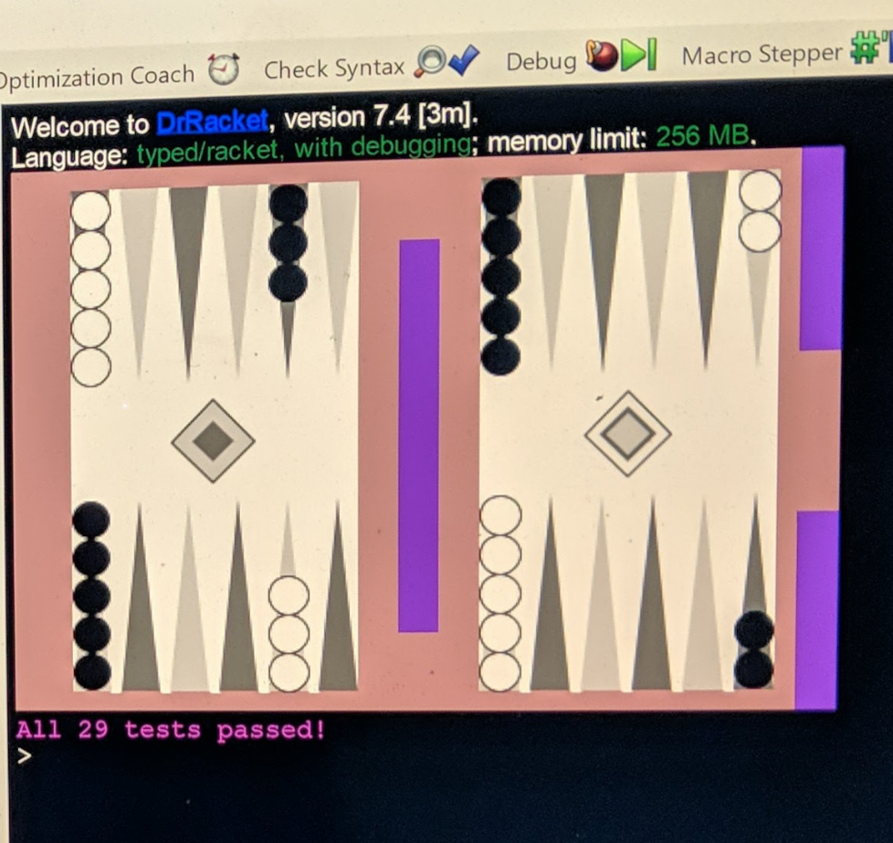

# Backgammon Project by Chanik Bryan Lee

## Files
 - `backgammon.rkt`: My source code / implementation for Backgammon
   - Note: Referenced packages in lines 2 - 6 belong to UChicago cs151 and is
     not included in this repo
 - `README.md`: This file
 - `example_board.png`: Example board screenshot during gameplay

Example board

